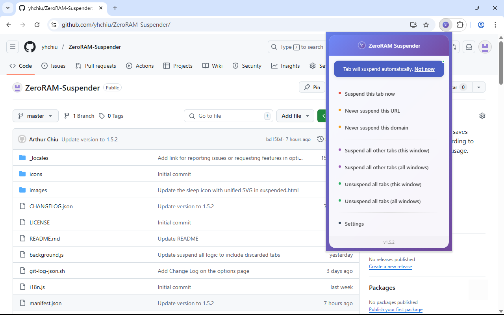

# ZeroRAM Suspender

A browser tab suspender that saves memory by using native discarding to achieve almost zero memory usage.

## What It Does

ZeroRAM Suspender dramatically reduces your browser's memory usage by intelligently suspending unused tabs. Unlike traditional tab suspenders that use placeholder pages, ZeroRAM Suspender utilizes the browser's native tab discarding mechanism to achieve almost zero memory consumption for suspended tabs. When a tab hasn't been used for a while, the extension automatically suspends it using this native approach, freeing up memory while keeping the tab available for instant restoration when you need it.

## Features

- **Near-Zero Memory Usage**: Uses native browser discarding to achieve almost zero memory consumption for suspended tabs
- **Automatic Tab Suspension**: Tabs are automatically suspended after being idle for a set time (default: 30 minutes)
- **Memory Optimization**: Choose between native browser discarding or lightweight placeholder pages
- **Whitelist Support**: Protect important websites from being suspended
- **Manual Controls**: Suspend or unsuspend tabs manually when needed
- **Tab Migration**: Seamlessly migrate suspended tabs from other tab suspension extensions (like The Marvellous Suspender)
- **Session Management**: Export and import all tabs from all windows for easy backup and restoration
- **Simple Interface**: Easy-to-use popup and settings page
- **Privacy Focused**: All processing happens locally - no data is sent to external servers

## Screenshots

### Extension Popup Interface

### Suspended Page

### Whitelist Management

### Tab Migration

### Session Management

## How to Install

### From Chrome Web Store (Recommended)
Install directly from the Chrome Web Store: [ZeroRAM Suspender](https://chromewebstore.google.com/detail/zeroram-suspender/nlnebbghnncihbiabpnhemjamfmjappo)

1. Visit the Chrome Web Store link above
2. Click "Add to Chrome" button
3. Confirm the installation when prompted

### From Source
1. Download or clone this repository
2. Open your browser's extension management page:
   - Chrome: Go to `chrome://extensions/`
   - Edge: Go to `edge://extensions/`
3. Enable "Developer mode"
4. Click "Load unpacked" and select the extension folder

## How to Use

### Basic Usage
Once installed, the extension works automatically. Inactive tabs will be suspended based on your settings.

### Manual Controls
Click the extension icon in your browser toolbar to access:
- **Suspend this tab now**: Immediately suspend the current tab
- **Suspend all other tabs**: Suspend all tabs except the active one
- **Unsuspend all tabs**: Restore all suspended tabs
- **Never suspend this URL/domain**: Add current site to whitelist

### Settings
Right-click the extension icon and select "Options" to configure:

- **Auto suspend timer**: Set how long tabs should be idle before suspension (0 = never)
- **Memory optimization**: Choose between native discard or placeholder pages
- **Whitelist**: Add URLs or domains that should never be suspended
- **Tab Migration**: Convert suspended tabs from other extensions to ZeroRAM Suspender format
- **Session Management**: Export and import all tabs from all windows

## Settings Explained

### Auto Suspend Timer
- Set in minutes (default: 30)
- Set to 0 to disable automatic suspension
- Only applies to inactive tabs

### Memory Optimization Options
- **Native Discard** (recommended): Uses browser's built-in tab discarding for maximum memory savings
- **Placeholder Page**: Uses lightweight placeholder pages with slightly less memory savings but better tab state preservation

### Whitelist
Add websites that should never be suspended:
- **Full URLs**: `https://example.com/important-page`
- **Domains**: `example.com` (covers all pages on that domain)
- **Subdomains**: `mail.google.com`

### Tab Migration
Migrate suspended tabs from other tab suspension extensions:
- **Supported Extensions**: The Marvellous Suspender (and its variants)
- **Auto Detection**: Automatically detects and lists suspended tabs from other extensions
- **Batch Migration**: Select multiple tabs to migrate at once

### Session Management
Export and import tab sessions for backup and restoration:
- **Export Current Session**: Save all tabs from all windows to a JSON file
- **Import Session**: Restore tabs from a previously exported session file
- **Backup & Restore**: Useful for switching devices or recovering after browser crashes
- **Full Window Support**: Preserves window grouping and tab order during export/import

## Privacy

This extension:
- Processes all data locally on your device
- Does not collect or transmit any personal information
- Does not communicate with external servers
- Only accesses tab information necessary for suspension functionality

## License

This project is licensed under the GNU General Public License v3 (GPL v3).

Copyright (C) Yu-Hsiung Chiu

## Contributing

Contributions are welcome! Please feel free to submit issues, feature requests, or pull requests.
